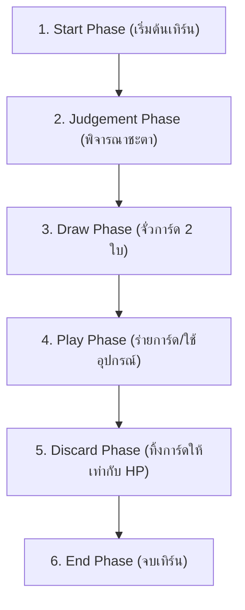

# ⚔️ WTK-Games (สามก๊ก การ์ดเกมเรียลไทม์)

> **สื่อการเรียนการสอนและคู่มือสถาปัตยกรรมระบบการพัฒนาระบบเกมมัลติเพลเยอร์เรียลไทม์ (Real-Time Multiplayer Card Game Framework)**  
> พัฒนาด้วยเทคโนโลยี **Node.js, Express, Socket.IO, Vanilla JavaScript (ES6+), HTML5/CSS3 Dark Glassmorphism 2.0, และ GSAP 3 Motion Engine**

---

## 📌 1. วัตถุประสงค์และภาพรวมโครงการ (Project Overview)

โครงการ **WTK-Games** คือเว็บแอปพลิเคชันเกมการ์ดสามก๊กเรียลไทม์มัลติเพลเยอร์ (War of the Three Kingdoms) ที่ถูกออกแบบมาเพื่อเป็น **สื่อการเรียนการสอน (Educational Resource)** ด้านการพัฒนาเว็บแอปพลิเคชันเชิงซ้อน, การจัดการ State Machine ของเกม, ระบบการสื่อสารแบบสองทางผ่าน WebSocket (Socket.IO), การออกแบบ UI/UX ตามมาตรฐาน Glassmorphism, และการสร้างภาพเคลื่อนไหวระดับ 60 FPS ด้วย GSAP

---

## 🎮 2. คู่มือการเล่นเกม (Game Rules & Playbook)

### 2.1 เป้าหมายชัยชนะตามบทบาท (Role Victory Conditions)
เกมรองรับผู้เล่นตั้งแต่ **4 ถึง 10 คน** โดยมีการสุ่มแจกบทบาทแบบลับเฉพาะบุคคลดังนี้:

| บทบาท (Role) | สีประจำบทบาท | เป้าหมายในการเอาชนะ (Goal) |
| :--- | :---: | :--- |
| **👑 จักรพรรดิ์ (Lord)** | 🟡 สีทอง | ปราบปรามกบฏและผู้ทรยศทั้งหมดให้สิ้นซาก เพื่อรักษาบัลลังก์ (*เปิดเผยตัวตนเสมอ*) |
| **🛡️ ภักดี (Loyalist)** | 🔵 สีฟ้า | ปกป้องจักรพรรดิ์ด้วยชีวิต และกำจัดศัตรูทั้งหมดของจักรพรรดิ์ |
| **🗡️ กบฏ (Rebel)** | 🔴 สีแดง | โค่นล้มและกำจัดจักรพรรดิ์ (Lord) ให้สำเร็จ |
| **☯️ ทรยศ (Renegade)** | 🟣 สีม่วง | กำจัดผู้เล่นทุกคนจนเหลือดวล 1v1 กับจักรพรรดิ์ แล้วกำจัดจักรพรรดิ์เป็นคนสุดท้าย |

> 💡 **โบนัสจักรพรรดิ์:** หากมีผู้เล่น $\ge 6$ คน จักรพรรดิ์จะได้รับพลังชีวิตสูงสุดเพิ่มขึ้น +1 HP!

---

### 2.2 ลำดับขั้นตอนใน 1 เทิร์น (6 Turn Phases)
เมื่อถึงเทิร์นของผู้เล่น ระบบจะดำเนินขั้นตอนตามลำดับดังนี้:



1. **Start Phase:** เคลียร์สถานะชั่วคราวและเตรียมความพร้อม
2. **Judgement Phase (คำพิจารณา):** ตรวจสอบไพ่หน่วงเวลาในโซ่พิจารณา (`LIGHTNING`, `ACEDIA`, `STARVATION`) สุ่มเปิดไพ่จากบนกองกลาง หากล้มเหลวจะถูกลงโทษ
3. **Draw Phase:** จั่วการ์ด 2 ใบจากกองกลางขึ้นมือ (ขุนพลจิวยี่จั่วได้ 3 ใบ)
4. **Play Phase:** ร่ายการ์ดบนมือได้อย่างอิสระ (การ์ดโจมตี SLASH ร่ายได้ 1 ครั้งต่อเทิร์น เว้นแต่สวมใส่หน้าไม้น่อกมม หรือเป็นเตียวหุย)
5. **Discard Phase:** หากการ์ดบนมือเกินกว่าพลังชีวิตปัจจุบัน (HP) ต้องเลือกลิบทิ้งการ์ดจนกว่าจำนวนการ์ดบนมือจะเท่ากับ HP
6. **End Phase:** สรุปผลและส่งต่อเทิร์นให้ผู้เล่นคนถัดไป

---

## 🃏 3. พจนานุกรมการ์ดทั้ง 41 ชนิด (Card Encyclopedia)

### 3.1 การ์ดพื้นฐาน (Basic Cards)
- ⚔️ **SLASH (โจมตี):** โจมตีเป้าหมายในระยะ อาวุธ สร้าง 1 ดาเมจ (ร่ายได้ 1 ครั้ง/เทิร์น)
- 🛡️ **DODGE (หลบหลีก):** ใช้ตอบสนองเพื่อหลบการโจมตีจาก SLASH หรือธนูหมื่นดอก
- 🍑 **PEACH (ลูกท้อ):** ฟื้นฟู 1 HP ให้ตนเองในเทิร์นตนเอง หรือใช้ช่วยชีวิตผู้เล่นที่กำลังจะตาย (HP $\le 0$)
- 🍷 **WINE (สุรากุหลาบ):** ใช้ในเทิร์นตนเองเพื่อเพิ่มพลังโจมตี SLASH ใบถัดไปเป็น 2 ดาเมจ หรือใช้ชุบชีวิตตนเองเมื่อ HP $\le 0$

### 3.2 การ์ดกลยุทธ์ (Stratagems)
- ✋ **STEAL (ขโมยไพ่):** ขโมยการ์ด 1 ใบ (บนมือ/อุปกรณ์/โซ่หน่วงเวลา) จากเป้าหมายระยะ 1
- 💥 **SABOTAGE (ทำลายไพ่):** เลือกทำลายการ์ด 1 ใบของเป้าหมายในสนามโดยไม่จำกัดระยะ
- ⚔️ **DUEL (การดวล):** ท้าดวลผู้เล่น 1 คน ทั้งสองฝ่ายต้องสลับกันทิ้ง SLASH ใครทิ้งไม่ได้ก่อนจะเสีย 1 HP
- 🔥 **FIRE_ATTACK (โจมตีด้วยไฟ):** เผยการ์ดบนมือเป้าหมาย หากผู้ร่ายทิ้งการ์ดที่มีดอกเดียวกับเป้าหมาย จะสร้าง 1 ดาเมจไฟ
- 🔗 **IRON_CHAIN (โซ่เหล็ก):** เลือกล่ามโซ่ผู้เล่น 1-2 คน (เมื่อผู้เล่นคนหนึ่งโดนดาเมจธาตุ ความเสียหายจะส่งผ่านไปยังทุกคนที่ติดโซ่) หรือใช้ทิ้งเพื่อจั่วการ์ดใหม่ 1 ใบ (Reforge)
- 📜 **EX_NIHILO (จั่วการ์ด 2 ใบ):** จั่วการ์ด 2 ใบขึ้นมือทันที
- 🏹 **ARROW_BARRAGE (ธนูหมื่นดอก):** โจมตีผู้เล่นทุกคน ทุกคนต้องทิ้ง DODGE 1 ใบ ไม่เช่นนั้นเสีย 1 HP
- 🐎 **BARBARIAN_INVASION (คนเถื่อนบุกรุก):** โจมตีผู้เล่นทุกคน ทุกคนต้องทิ้ง SLASH 1 ใบ ไม่เช่นนั้นเสีย 1 HP
- 🌸 **PEACH_GARDEN (คำปฏิญาณสวนท้อ):** ฟื้นฟู 1 HP ให้ผู้เล่นทุกคนในสนาม
- 🌾 **BUMPER_HARVEST (เก็บเกี่ยวสมบูรณ์):** เปิดการ์ดจากกองกลางเท่าจำนวนผู้เล่น ให้ทุกคนเลือกหยิบ 1 ใบ
- 🗡️ **BORROWED_SWORD (ยืมดาบฆ่าคน):** บังคับเป้าหมายคนแรก (ผู้สวมใส่อาวุธ) ให้ใช้ SLASH โจมตีเป้าหมายคนที่สอง หากไม่ทำจะถูกยึดอาวุธส่งให้ผู้ร่าย
- ⛔ **NEGATE (ไร้ข้อกังขา):** ร่ายเพื่อยกเลิกผลของการ์ดกลยุทธ์ใดๆ ก็ตาม

### 3.3 การ์ดพิจารณาหน่วงเวลา (Delayed Kits)
- 🌀 **ACEDIA (สุขไม่คิดกลับ):** วางใส่เป้าหมาย เมื่อถึง Judgement Phase หากเปิดได้ไพ่ที่ไม่ใช่สีแดง (Heart) จะถูกข้าม Play Phase
- 🌾 **STARVATION (เสบียงขาด):** วางใส่เป้าหมาย หากเปิดได้ไพ่ที่ไม่ใช่ดอกข้าวหลามตัด (Club) จะถูกข้าม Draw Phase
- ⚡ **LIGHTNING (อัสนีบาต):** วางในโซ่พิจารณาตนเอง หากเปิดได้ไพ่โพดำ (Spade 2-9) จะโดนสายฟ้าฟาด 3 ดาเมจ! หากไม่ติด จะเวียนไปให้ผู้เล่นคนถัดไป

### 3.4 ชุดอุปกรณ์สวมใส่ (Equipments)
- 🏹 **อาวุธ 12 ชนิด (Weapons - ระยะโจมตี 1 ถึง 5):**
  - **ZHUGE_CROSSBOW (หน้าไม้น่อกมม - ระยะ 1):** ร่าย SLASH ได้ไม่จำกัดจำนวนครั้ง
  - **BLUE_STEEL_SWORD (กระบี่เหล็กฟ้า - ระยะ 2):** โจมตีทะลวงและมองข้ามชุดเกราะของเป้าหมาย 100%
  - **YIN_YANG_SWORDS (กระบี่คู่หยินหยาง - ระยะ 2):** เมื่อฟันเพศตรงข้าม บังคับเป้าหมายทิ้งไพ่ 1 ใบหรือให้เราจั่ว 1 ใบ
  - **GREEN_DRAGON_BLADE (ง้าวเขียวมังกรดำ - ระยะ 3):** หากเป้าหมายใช้ DODGE หลบได้ สามารถร่าย SLASH โจมตีซ้ำได้ทันที
  - **SERPENT_SPEAR (ทวนอสรพิษ - ระยะ 3):** ทิ้งการ์ดบนมือ 2 ใบใดๆ เพื่อใช้แทน SLASH ได้
  - **ROCK_CLEAVING_AXE (ขวานผ่าหิน - ระยะ 3):** หากเป้าหมายใช้ DODGE สามารถทิ้งไพ่ 2 ใบเพื่อบังคับให้โดนดาเมจทันที
  - **FEATHERED_FAN (พัดขนนก - ระยะ 4):** เปลี่ยน SLASH ปกติให้กลายเป็น SLASH ธาตุไฟ
  - **KIRIN_BOW (คันธนูเกิลหลิน - ระยะ 5):** เมื่อสร้างดาเมจด้วย SLASH สามารถยึด/ทำลายม้าของเป้าหมายได้
- 🛡️ **ชุดเกราะ 4 ชนิด (Armors):**
  - **EIGHT_TRIGRAMS_FORMATION (เกราะประยุทธ์แปดทิศ):** สุ่มเปิดไพ่พิจารณา 3D หากเป็นสีแดง ถือว่าหลบหลีกสำเร็จเสมือนร่าย DODGE
  - **NIO_SHIELD (เกราะเสือโคร่ง):** ป้องกันการ์ดโจมตีสีดำ (Spade/Club) 100%
  - **SILVER_LION_HELMET (หมวกสิงโตเงิน):** จำกัดความเสียหายสูงสุดไม่เกิน 1 HP ต่อครั้ง และเมื่อถูกถอด/ทำลาย จะฟื้นฟู 1 HP
  - **RATTAN_ARMOR (เกราะหวาย):** ป้องกัน SLASH ปกติ, ธนูหมื่นดอก, และคนเถื่อนบุกรุก แต่รับดาเมจไฟแรงขึ้น +1 HP
- 🐎 **พาหนะ (Mounts):**
  - **RED_HARE (ม้ากระต่ายแดง):** ลดระยะห่างขณะโจมตีผู้อื่น (-1 Distance) / เพิ่มระยะห่างป้องกันตนเอง (+1 Distance)

---

## 🧙‍♂️ 4. คลังขุนพลสามก๊กทั้ง 12 ตัว (Hero Skills)

| ขุนพล (Hero) | HP | ความสามารถพิเศษ (Skill Description) |
| :--- | :---: | :--- |
| **เล่าปี่ (Liu Bei)** | 4 | **คุณธรรม (Benevolence):** มอบการ์ดให้ผู้เล่นคนอื่น หากมอบรวมครบ 2 ใบขึ้นไปจะฟื้นฟู 1 HP |
| **กวนอู (Guan Yu)** | 4 | **เทพสงคราม (Martial Saint):** การ์ดสีแดงทุกใบในมือ สามารถใช้เป็น SLASH ได้ |
| **จูล่ง (Zhao Yun)** | 4 | **มังกรผาดโผน (Dragon Courage):** ใช้ SLASH แทน DODGE และใช้ DODGE แทน SLASH ได้ |
| **เตียวหุย (Zhang Fei)** | 4 | **ดุดัน (Fierce):** ใช้การ์ด SLASH ได้ไม่จำกัดจำนวนครั้งใน 1 เทิร์น |
| **โจโฉ (Cao Cao)** | 4 | **จอมคนโอบเอื้อ (Heroic Embrace):** เมื่อได้รับความเสียหาย จะได้รับการ์ดใบที่สร้างความเสียหายนั้นมาขึ้นมือ |
| **จิวยี่ (Zhou Yu)** | 3 | **สง่างาม (Handsome):** จั่วการ์ด 3 ใบช่วง Draw Phase / **บ่มเพลิง:** ทิ้งการ์ด 1 ใบให้ศัตรูทายสี หากทายผิดจะโดน 1 ดาเมจ |
| **ซุนกวน (Sun Quan)** | 4 | **สละราชย์ (Resignation):** ทิ้งการ์ด N ใบ เพื่อจั่วการ์ดใหม่ N ใบ (1 ครั้ง/เทิร์น) |
| **ลิโป้ (Lu Bu)** | 5 | **ไร้ต่อสู้ (Unmatched):** การร่าย SLASH บังคับให้เป้าหมายต้องทิ้ง DODGE 2 ใบ และการดวล (DUEL) ต้องใช้ SLASH 2 ใบ |
| **เตียวเสี้ยน (Diao Chan)** | 3 | **บ่วงเสน่หา (Seduction):** บังคับชาย 2 คนดวลกัน / **งามล่มเมือง:** จั่วการ์ด 1 ใบฟรีเมื่อจบเทิร์น |
| **เตียวซี/เอี๋ยมสี (Zhen Ji)** | 3 | **เทพแม่น้ำล่อจุย (Luo River):** สุ่มจั่วการ์ดสีดำขึ้นมือเรื่อยๆ จนกว่าจะเปิดเจอการ์ดสีแดง |
| **อุยกาย (Huang Gai)** | 4 | **ยอมทุกข์ทรมาน (Self-Sacrifice):** ยอมเสีย 1 HP เพื่อจั่วการ์ด 2 ใบ (ใช้กี่ครั้งก็ได้ในเทิร์น) |
| **สุมาอี้ (Sima Yi)** | 3 | **โต้ตอบ (Retaliation):** เมื่อโดนดาเมจ สุ่มดึงการ์ด 1 ใบจากผู้ทำดาเมจ / **เปลี่ยนชะตา:** สลับเปลี่ยนไพ่พิจารณาได้ |

---

## 💻 5. อธิบายสถาปัตยกรรมและฟังก์ชันในซอร์สโค้ด (Codebase Architecture for Teaching)

โครงสร้างซอร์สโค้ดถูกแบ่งออกเป็น **Server-Side Architecture** และ **Client-Side Architecture** อย่างชัดเจน เพื่อให้ง่ายต่อการนำไปใช้เป็นสื่อการเรียนการสอน:

```
WTK-Games/
├── server.js               # Node.js + Socket.IO Server (State Machine & Logic)
├── rules.json              # ข้อกำหนดและกฎกติกาเกมฉบับมาตรฐาน
├── AGENTS.md               # ข้อกำหนดสถาปัตยกรรมและ Skill Registry
├── README.md               # คู่มือการเล่นและสื่อการเรียนการสอน
├── public/
│   ├── room.html           # หน้าจอเกมหลัก (Glassmorphism 2.0 UI)
│   ├── lobby.html          # หน้าห้องพักรอเล่นเกม
│   ├── room_app.js         # Client-side Game Controller & Canvas/GSAP Handlers
│   ├── lobby.js            # Client-side Lobby Controller
│   ├── style.css           # Design System & Responsive Layout (100vh)
│   ├── cards_db.json       # พจนานุกรมการ์ด 41 ชนิด และ pic_url
│   └── heroes.json         # ฐานข้อมูลขุนพล 12 ตัว และคำแปลสกิลภาษาไทย
└── skills/                 # Open Design Skills Registry
```

### 5.1 ฟังก์ชันสำคัญฝั่ง Server (`server.js`)
1. **`initDeck()`:** สร้างและสับกองการ์ด 41 ชนิด พร้อมการ์ดสเปกตรัมหลากสีและแต้ม
2. **`startNextTurn(room)`:** ระบบ State Machine จัดการเปลี่ยนเทิร์น ตรวจสอบสถานะการรอดชีวิต และประมวลผล 6 Phase
3. **`dealDamage(room, targetPlayerId, damage, cardUsed, attackerId, damageType)`:** ฟังก์ชันคำนวณความเสียหาย ตรวจสอบผลพาสซีฟของชุดเกราะ (`NIO_SHIELD`, `SILVER_LION_HELMET`, `RATTAN_ARMOR`, `BLUE_STEEL_SWORD`) และจัดการสถานะใกล้ตาย (`DYING`)
4. **`startNegateWindow(room, pendingAction)`:** เปิดหน้าต่างให้ผู้เล่นทุกคนร่ายการ์ดไร้ข้อกังขา (`NEGATE`) ขัดขวางผลของการ์ดกลยุทธ์
5. **`endPlayerTurn(room)`:** ปิดเทิร์น ตรวจสอบเงื่อนไขการชนะของทุกบทบาท และย้ายเทิร์นอย่างปลอดภัย

### 5.2 ฟังก์ชันสำคัญฝั่ง Client (`public/room_app.js`)
1. **`renderHand()`:** วาดการ์ดบนมือแบบคลี่พัด (Card Fan) คำนวณมุมและระยะห่าง `translate(x, y) rotate(deg)` พร้อมแสดงป้ายระยะโจมตีสีทอง `(ระยะ: N)` บนการ์ดอาวุธ
2. **`renderOpponents()`:** วาดการ์ดคู่ต่อสู้รอบโต๊ะตามมุมองศารูปครึ่งวงกลม ($10^\circ \rightarrow 170^\circ$) คำนวณระยะห่างระหว่างผู้เล่น ให้ออร่าสีทองนำสายตาเป้าหมาย
3. **`onSelectTarget(targetPlayerId)`:** ระบบจัดการเลือกเป้าหมายแบบ 2-Step Workflow สำหรับการ์ดหลายเป้าหมาย (`BORROWED_SWORD`, `IRON_CHAIN`)
4. **`showJudgementCardFlipAnimation(title, card, isSuccess, playerName)`:** ฟังก์ชันแสดงผลหน้าต่างเปิดไพ่พิจารณาชะตา 3D ด้วย GSAP Engine

---

## 🧪 6. โหมดทดสอบสำหรับแอดมิน (Admin Test Sandbox)

ผู้สอน ผู้พัฒนา หรือแอดมินสามารถใช้โหมดทดสอบเพื่อทดลองการ์ดและสกิลขุนพลทุกตัวได้อย่างอิสระผ่าน 2 ช่องทาง:

1. **เข้าผ่าน URL พิเศษ:** เปิดเบราว์เซอร์ไปที่ **`http://localhost:3001/test`**
2. **เข้าผ่านปุ่มเมนู:** กดปุ่ม **`🛠️ Admin Sandbox`** (สีส้มทอง) บนแถบเมนูด้านบนของหน้าจอเกม

### ฟังก์ชันในแผงควบคุม Admin Sandbox:
- 🧙‍♂️ **Hero Switcher:** เปลี่ยนตัวละครเป็นขุนพลคนใดก็ได้ใน 12 ตัวทันที
- 🃏 **Card Spawner:** เลือกเสกการ์ดชนิดใดก็ได้จาก 41 ชนิดขึ้นมือ
- ❤️ **HP Controls:** ปรับเพิ่ม/ลด HP หรือตั้งค่า `HP = 1` เพื่อทดสอบสถานะวิกฤตใกล้ตาย
- 🤖 **Bot Spawner:** เสกบอทคู่ต่อสู้เข้าร่วมทดสอบได้ทันที

---

## 🚀 7. วิธีการติดตั้งและเริ่มต้นใช้งาน (Getting Started)

### ความต้องการของระบบ (Prerequisites)
- **Node.js**: เวอร์ชัน 16.x ขึ้นไป
- **npm**: เวอร์ชัน 8.x ขึ้นไป

### ขั้นตอนการรันระบบ (Step-by-Step)
1. **ดาวน์โหลดหรือ Clone คลังโค้ด:**
   ```bash
   git clone https://github.com/Itsmnatom/WTK-Games.git
   cd WTK-Games
   ```
2. **ติดตั้ง Dependencies:**
   ```bash
   npm install
   ```
3. **เริ่มต้นเซิร์ฟเวอร์:**
   ```bash
   node server.js
   ```
4. **เข้าใช้งานผ่านเบราว์เซอร์:**
   - หน้าล็อบบี้หลัก: `http://localhost:3001/lobby`
   - โหมดทดสอบแอดมิน: `http://localhost:3001/test`
   - ดูข้อมูลสถิติผู้เล่นผ่าน SQL API: `http://localhost:3001/api/leaderboard`
5. **วิธีเข้าดูข้อมูลใน SQL Database (`db/wtk_game.sqlite`):**
   - **ผ่าน Terminal Command:** รันคำสั่ง `node db/view_db.js` เพื่อแสดงตารางสถิติผู้เล่นและประวัติการแข่งในคอนโซล
   - **ผ่าน GUI Program:** ใช้โปรแกรม [DB Browser for SQLite](https://sqlitebrowser.org/) หรือ VS Code Extension `SQLite Viewer` เปิดไฟล์ `db/wtk_game.sqlite`

---

## 📜 8. ลิขสิทธิ์และการนำไปใช้ (License & Citation)

โครงการนี้จัดทำขึ้นเพื่อประโยชน์ทางการศึกษาและการเรียนรู้การพัฒนาเกมการ์ดเรียลไทม์ สามารถนำไปใช้เป็นสื่อการเรียนการสอน พัฒนาต่อยอด หรือศึกษาโครงสร้างซอร์สโค้ดได้โดยเสรี

---

## 📝 9. บันทึกประวัติการปรับปรุงระบบและฟีเจอร์ใหม่ (Changelog & Updates)

| เวอร์ชัน (Version) | รายละเอียดการปรับปรุง (System Updates & Features) |
| :---: | :--- |
| **v1.7.0** | 🤖 เพิ่มระบบ **Bot Controller & Passive Mode ในโหมด `/test`**: กำหนดให้บอทอยู่เฉยๆ ไม่เล่นอัตโนมัติ (Passive), เพิ่มปุ่ม **➕ เพิ่มบอท**, **➖ ลบบอทออก**, **⏩ สั่งบอทผ่านเทิร์น**, และ **⚔️ สั่งบอทฟันใส่เรา** |
| **v1.6.2** | ⚡ ปรับสลับลำดับความสำคัญให้ URL Query Parameters (`params.get(...)`) มีลำดับความสำคัญสูงกว่า `sessionStorage` เพื่อให้ Intent จาก URL ในโหมดทดสอบ `/test` (`action=create`, `mode=BOT`) ทำงานได้อย่างถูกต้องเสมอมิโดนค่าเก่าทับ |
| **v1.6.1** | 🐞 แก้ไขบั๊ก String Mismatch การต่อเชื่อมใหม่ (`reconnect_player`) เติม `critical: true` และสั่งล้าง `localStorage` เคลียร์ `activeRoomId`/`activePlayerId` เมื่อเกิดข้อผิดพลาดวิกฤต ป้องกันอาการค้างหน้าจอเปล่า |
| **v1.6.0** | 🔐 แยกสิทธิ์ผู้เล่น **Player (สิทธิ์ผู้เล่นทั่วไป)** กับ **Admin (สิทธิ์แอดมินทดสอบระบบ)** ออกจากกันอย่างสมบูรณ์ ซ่อนปุ่ม Admin และเพิ่มระบบยืนยันสิทธิ์ Socket Authentication (`socket.isAdmin`) ป้องกันการส่งคำสั่งข้ามสิทธิ์ |
| **v1.5.1** | 🛡️ เพิ่มไฟล์ `.gitignore` ครอบคลุม `node_modules/`, `*.sqlite`, และไฟล์คอนฟิกชั่วคราว |
| **v1.5.0** | 🗄️ เพิ่มเลเยอร์ฐานข้อมูล **SQL Database (`db/database.js`)** ด้วย SQLite3 และระบบ **Plugin Architecture (`plugins/plugin_manager.js`)** พร้อม API `/api/leaderboard` |
| **v1.4.1** | ⚡ ปรับปรุงระบบเข้าเล่นโหมดทดสอบ `/test`: แก้ไข Redirect Loop, เพิ่มการตรวจจับ Null Check ป้องกัน Error, และเพิ่ม Auto-Start แมตช์พร้อมเสกบอท 3 ตัวให้อัตโนมัติ |
| **v1.4.0** | 🛠️ เพิ่มโหมด **Admin Test Sandbox (`/test`)** พร้อมแผงควบคุมสลับเปลี่ยนขุนพล, เสกการ์ด 41 ชนิด, ปรับ HP, และเสกบอทคู่ต่อสู้ |
| **v1.3.0** | 📖 จัดทำคู่มือสื่อการเรียนการสอนและสถาปัตยกรรมระบบใน `README.md` ภาษาไทยฉบับสมบูรณ์ |
| **v1.2.0** | 🎯 เพิ่มระบบเลือก 2 เป้าหมายสำหรับโซ่เหล็ก (`IRON_CHAIN`) และยืมดาบฆ่าคน (`BORROWED_SWORD`) พร้อมออร่าสีทองนำสายตา |
| **v1.1.0** | 🎨 เพิ่มการแสดงผลระยะโจมตีอาวุธ `(ระยะ: N)` บนมือ, แอนิเมชันเปิดไพ่พิจารณา 3D, และอัปเกรด Glassmorphism UI 2.0 |

